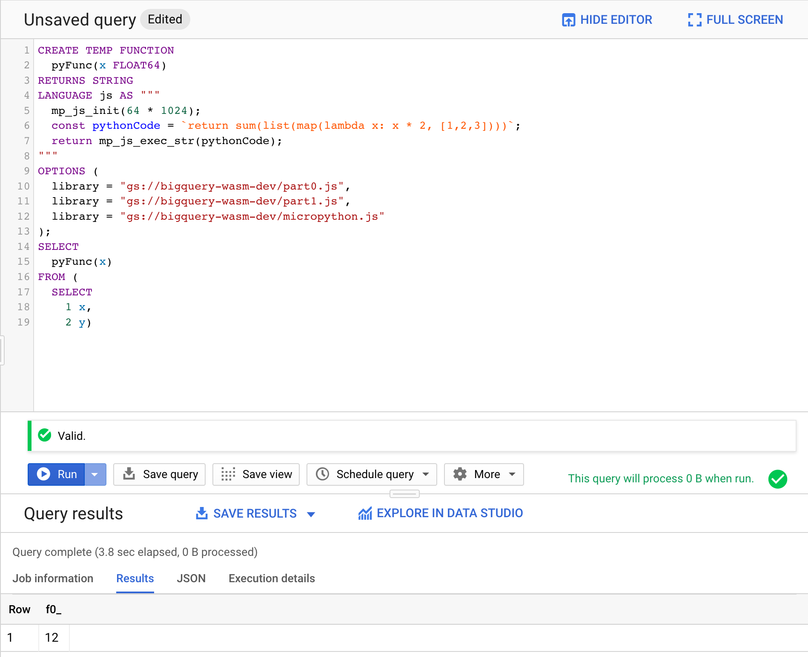

# User-Defined Functions with Python in BigQuery

BigQuery supports user-defined functions written in JavaScript. Some prior art showcased that WebAssembly is supported in the JavaScript ecosystem running on BigQuery. This project demonstrates how WebAssembly can be used to bring Python into BigQuery. Since BigQuery has a lot of limitations, [MicroPython](https://github.com/micropython/micropython) with some modification is used.

## Usage

The `udf.py` script automatically generates a skeleton UDF function using MicroPython. Optionally, it allows to provide a Google Storage location where supporting files can automatically get uploaded. For this it is necessary to have write permissions in the bucket and to export `GOOGLE_APPLICATION_CREDENTIALS`.

```
$ python3 udf.py --help                                                                                                                                                                                                 
usage: udf.py [-h] [--input INPUT [INPUT ...]] [--gcs-bucket GCS_BUCKET]
              [--gcs-path GCS_PATH] [--python-file PYTHON_FILE]

This script generates the UDF which uses MicroPython to be used in BigQuery.
Supporting files can optionally be automatically pushed into a specified
Google Cloud Storage bucket. A Python file can be provided whose code will be
used used in the generated UDF.

optional arguments:
  -h, --help            show this help message and exit
  --input INPUT [INPUT ...]
                        The JavaScript files to be used in BigQuery UDF.
  --gcs-bucket GCS_BUCKET
                        The bucket in Google Cloud storage where the
                        MicroPython should be uploaded to.
  --gcs-path GCS_PATH   The path in Google Cloud storage where the MicroPython
                        should be uploaded to.
  --python-file PYTHON_FILE
                        Path to file whose code should be used in the
                        generated UDF.
```

### Example UDF

An exemplary UDF using MicroPython for BigQuery could look like:

```sql
CREATE TEMP FUNCTION
    pyFunc(x FLOAT64)
RETURNS STRING
LANGUAGE js AS """
    mp_js_init(64 * 1024);
    const pythonCode = `return sum(list(map(lambda x: x * 2, [1,2,3])))`;
    return mp_js_exec_str(pythonCode);
"""
OPTIONS (
    library = "gs://bucket/path/part0.js",
    library = "gs://bucket/path/part1.js",
    library = "gs://bucket/path/MicroPython.js"
);
SELECT
  pyFunc(x)
FROM (
  SELECT
    1 x,
    2 y)
```

First, MicroPython must be initialized with a given stack size in bytes using `mp_js_init()`. Then Python code can get passed into `mp_js_exec_str()` as a string and the value of the last `return` statement will be returned as result.

The external file `MicroPython.js` exposes available Javascript functions, such as `mp_js_init` and `mp_js_exec_str`, the files `part0.js` and `part1.js` contain the bytes of the MicroPython WebAssembly which get concatenated and used to initialize MicroPython in BigQuery. The MicroPython WebAssembly needs to be split over several files since BigQuery only allows external files to have a maximum file size of 1 MB.

The query can be copied into the BigQuery Web console and executed there:




## Limitations

BigQuery has the following limitations related to the use of user-defined functions:
* maximum inline code blob size of 32 KB
* external code files can have a size of up to 1 MB
* total size of external resources is max. 5 MB
* UDFs timeout after 60s
* ca. 40 MB of memory available for JavaScript processing environment
* the JavaScript environment does not support `async` in Standard SQL and does not support certain other functions for loading external resources, such as `require` or `fetch`

These limitations make it impossible to use fully-fledged Python including the Python Standard Library which, for example, [Pyodide](https://github.com/iodide-project/pyodide) offers. MicroPython is optimized to run on embedded systems and can run on BigQuery with some modifications. Using MicroPython in BigQuery has some limitations as well:
* no Python Standard Library
* currently no support for importing other packages


## Build from Scratch 

To generate all the JavaScript files for using MicroPython in BigQuery, [Python 3](https://www.python.org/downloads/) and [emscripten](https://emscripten.org/docs/getting_started/downloads.html) needs to be installed. Run `make` to start the build process.

To use a newer version of MicroPython, update the commit hash in `Makefile`. This will most likely break applying the changes in `MicroPython.patch`, so these changes need to be adjusted for newer versions.

Generated files will be written to `build/`
